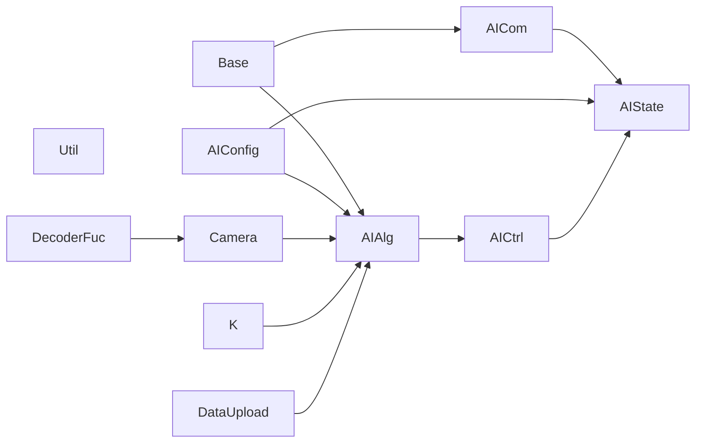

# rtc_server

```mermaid
flowchart LR
    BASE[Base]
    UTIL[Util]
    COM[AICom]
    STATE[AIState]
    CTRL[AICtrl]
    CAM[Camera]
    DEC[DecoderFuc]
    ALG[AIAlg]
    UP[DataUpload]
    CFG[AIConfig]


    BASE --> COM
    COM --> STATE
    CFG --> STATE
    CTRL --> STATE
    BASE --> ALG
    CFG --> ALG
    ALG --> CTRL
    DEC --> CAM
    CAM --> ALG
    K --> ALG
    UP --> ALG
```

